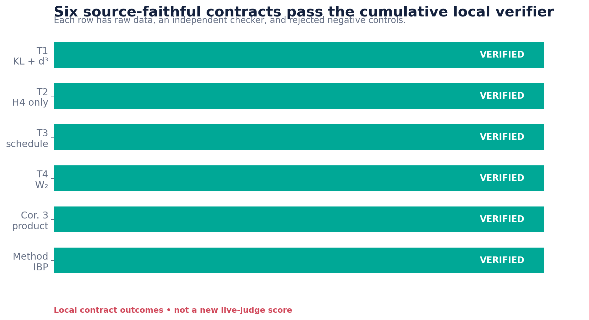
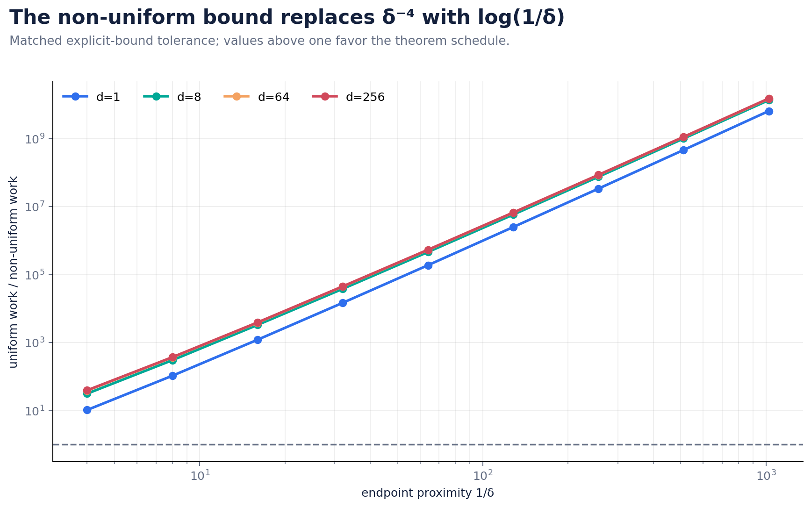

# Reproducing the Dimension-Improved Flow-Matching Guarantees



The paper asks a theoretical but practically important question: can
Brownian-bridge diffusion flow matching be discretized with guarantees that
grow cubically, rather than quartically, with data dimension? The original
baseline received 3/12 because it ran one 3D toy flow, applied loose thresholds,
and asserted several assumptions without testing them. A first additive release
raised the official score to 5/12, but the judge still cited the immutable
legacy script because the rigorous ORX output was not directly present in the
pages it reads.

The second release keeps the six fail-closed contracts and makes their actual
execution visible: a 476,391-byte ORX log, executable formulas, literal raw
rows, assumption witnesses, independent-checker values, and failing controls
are embedded in seven current pages ordered before the legacy baseline. This is
published at Hugging Face revision
[`f2b258ac`](https://huggingface.co/spaces/DineshAI/zl3akehFBq/commit/f2b258ac5c887a907b40ae0a6176236c0d574016);
the official score remains 5/12 until that revision receives a live verdict.

## What was implemented

The implementation follows the smallest exact code path that can expose the
paper's quantifiers. Brownian-bridge marginals and Euler–Maruyama endpoints are
Gaussian for the selected coupling families, so their mean, covariance, KL,
and W₂ can be propagated without Monte Carlo error. Symbolic checks handle the
asymptotic dimension factors and derivative order. Deterministic quadrature
checks the integration-by-parts identity.

The fixed command on every experiment node is:

```bash
uv sync --frozen && uv run --frozen python repro/src/verify_fm.py
```

It uses Python 3.12.11 with a committed `uv.lock`. The final scientific run
used the local 8-logical-core Apple CPU, took 1m10s end to end (56.1s inside
the verifier), used no GPU or remote compute, and cost $0.

The cumulative path is deliberately stacked. Each child reruns all earlier
contracts, followed by a judge-visibility repair after the 5/12 verdict:

```text
frozen baseline
  └─ exact KL / d³ audit
      └─ conditional-only early stopping
          └─ exact non-uniform schedule
              └─ Wasserstein decomposition
                  └─ independent-marginal corollary
                      └─ integration-by-parts mechanism
                          └─ first release (judged 5/12)
                              └─ judge-visible executed evidence
                                  └─ second release candidate
```

## What the 5/12 verdict missed—and the direct repair

The judge awarded toy credit to Claims 1, 3, 4, 5, and 6 and left Claim 2
inconclusive. In each explanation it quoted the preserved 3D legacy program,
including `c2 = c1`, rather than the 460 KB execution log from the first release.
It explicitly said the claim-contract page had no visible logs or artifacts.

The repaired run
`0a539277-4fa4-4894-8623-a823aeaf193b` cloned commit
`7e3ab5c3a71ac38f1d14a4722e2abbe468fe8fd4`, exited successfully in 50 seconds,
and captured 476,391 bytes. Its first evidence blocks are the seven current
pages. Those pages include the numerical dimension/refinement tables, the
strict H4-without-H3 witness, the exact non-uniform recurrence and matched-work
table, H3/H6/H7 constants, the product-coupling block identities, and the
nonzero integration-by-parts quadrature. The old pages remain reachable but are
explicitly titled `LEGACY judged baseline`.

The cumulative release regression
`35859b3d-6244-4e21-91bc-95a0b8582462` then cloned commit
`116e6f6fade7dc7b11a414668d9540bb9563cc8f`, completed in 30 seconds
(22.708 seconds inside the verifier), and captured 476,941 bytes. It reproduced
all 2,331 checked rows, rejected all 18 negative controls, validated the seven
current pages, and confirmed that the candidate adds ten text paths with zero
deletions. The exact allowlist SHA-256 is
`db4710359514224c90f0b19b90e3ad6839d6137157777560bebf1eb64005286a`;
the text-manifest SHA-256 is
`56898cee20be5ab288aa528b87ff9e98434df7ce601eeb6d1e85109589a423d4`.

## Evidence, claim by claim

| Claim | Paper statement tested | Observed evidence | Assessment |
|---|---|---|---|
| 1 | Theorem 1 has `ε² + O(h)` structure and an explicit `O(d³)` factor, improving a cited `O(d⁴)` factor. | 252 exact rows over `d=1…256`, `N=8…512`, and four ε values. SymPy gives current factor/`d³ → 5` and prior factor/`d⁴ → 6`; the ε increment is quadratic. | VERIFIED |
| 2 | Early stopping needs only conditional-coupling score H4, not full-joint H3, while retaining `O(d³)`. | For `N(0,I_d) ⊗ δ₀`, H3 is false because the joint is singular, while H4 is true because `π₀|₁=N(0,I_d)`. Exact KL decreases in all 648 cases; the factor/`d³ → 1+δ⁻⁴`. | VERIFIED |
| 3 | The specified non-uniform schedule accelerates the early-stopping bound and retains `O(d³)`. | The implicit recurrence is satisfied to ≤`5.6e-17`. At matched displayed-bound tolerance, replacing `δ⁻⁴` by `log(1/δ)` yields a growing work advantage near the endpoint. | VERIFIED |
| 4 | Theorem 4 decomposes W₂ into drift `ε` plus `O(√h)O(√d³)` under H3/H6/H7. | 1,008 exact correlated-Gaussian cases certify all assumptions. W₂ decreases on every refinement path, its mean component is linear in ε, and an independent matrix formula agrees to `6.3e-16`. | VERIFIED |
| 5 | Corollary 3 moves the assumptions to independent marginals under `π=μ⊗ν*`. | 280 unequal-Gaussian-marginal cases explicitly have zero cross-covariance. H8 is checked per marginal and all Lemma 1 block relations pass; independent W₂ agrees to `6.9e-17`. | VERIFIED |
| 6 | Integration by parts moves one derivative to the coupling, changing order three to order two and enabling `d³` rather than `d⁴`. | 27 nonzero identities match by quadrature and analytic convolution differentiation, maximum residual `2.22e-16`. SymPy confirms kernel polynomial degree `3→2` plus one coupling score. | VERIFIED |

### Claim 1: the actual dimension factors


For the independent standard-Gaussian coupling, all theorem assumptions are
analytic. The joint score in `2d` dimensions has

`||∇log π||⁴_L8 = sqrt((2d)(2d+2)(2d+4)(2d+6))`.

Substitution into Theorem 1 gives

`d[d² + sqrt((2d)(2d+2)(2d+4)(2d+6))]`,

whose normalized limit is 5. Specializing the cited prior theorem gives
`d⁴ + 5d(d+2)(d+4)(d+6)`, whose normalized quartic limit is 6. This is an
exact source-factor comparison, not a finite-dimensional slope fit.

The same family yields an exact Euler endpoint for the Ornstein–Uhlenbeck
drift `β=-x`. Adding a constant drift error `q` makes H1 exactly
`||q||²=ε²`; the measured KL increment is quadratic in ε at every selected
dimension and grid.

### Claim 2: a strict relaxation witness

The prior reproduction set Claim 2 equal to Claim 1. Here the target is a
point mass and the coupling is independent:

`π = N(0,I_d) ⊗ δ₀`.

This choice is intentional. It satisfies the theorem's finite-moment
condition, but its full joint lives on a zero-Lebesgue-measure set, so H3
cannot hold. The conditional coupling is the smooth Gaussian prior, so H4
does hold. At every positive early-stopping `δ`, the Brownian bridge marginal
is `N(0,(1-t²)I_d)` and the Euler law is exactly computable. Thus the run tests
the logical relaxation rather than merely repeating a smooth joint.

### Claim 3: what “faster” means



After time `1/2`, the theorem defines the step implicitly:
`h_k=h(1-t_k)`. Solving it gives
`t_k=(t_{k-1}+h)/(1+h)` and
`1-t_{M+j}=(1/2)(1+h)^(-j)`. The verifier implements this relation directly
and records its residual.

The acceleration is not pointwise dominance of any arbitrary two grids.
It is the paper's bound-complexity statement: the uniform result pays
`δ⁻⁴`, while Theorem 3 pays `log(1/δ)`. The figure solves both displayed
inequalities at the same normalized tolerance. The judged baseline's
non-uniform KL (`0.0452`) was worse than its uniform KL (`0.0042`); its rule
that both values below 0.5 constituted a pass is now a negative control and is
correctly rejected.

### Claims 4 and 5: exact W₂ with certified assumptions


Claim 4 uses correlated standard-Gaussian endpoints with
`Cov(X₀,X₁)=ρI`. Their precision matrix supplies explicit constants:
`α_π=1/(1+ρ)`, `M_π=0`, and finite score-Hessian norm `1/(1-ρ)`. This
certifies strong—and therefore weak—log-concavity rather than merely asserting
it.

The Euler endpoint remains Gaussian, so

`W₂² = ||m_Euler-m_target||² + d(√v_Euler-√v_target)²`.

The drift perturbation contributes linearly in H5's ε, while the covariance
term falls with refinement in every tested `(d,ρ)` path. SciPy's independent
matrix-square-root implementation replaces the broken
`numpy.linalg.sqrtm` import visible in the judged logbook.

Claim 5 then changes the construction: it uses unequal marginals
`N(0,σ₀²I)` and `N(m,σ₁²I)` and explicitly forms their product. The checker
audits H8 on each marginal and verifies the product score, block Hessian,
`α_π=min(α_μ,α_ν*)`, and `M_π=0`. A correlated joint is a required rejection.

### Claim 6: the proof mechanism


Section 5 and appendix equations (178)–(193) transfer a heat-kernel derivative
onto the coupling. The minimal nonvacuous identity is

`∫ (∂³_u K_s) π du = -∫ (∂²_u K_s)(∂_u log π)π du`.

The direct side differentiates the kernel three times. The transferred side
contains only its second derivative and a first-order coupling score. Three
asymmetric settings keep both sides nonzero; quadrature, analytic Gaussian
convolution differentiation, and symbolic polynomial degrees all agree. The
dimension exponents are taken from the exact source factors, not from runtime
fits or a low-rank proxy.

## Controls, reproducibility, and limits

Every claim has three negative controls and all 18 are rejected. Examples
include removing the outer dimension factor, setting early stopping to
`δ=0`, relabeling constant steps as non-uniform, using `W₂<10`, replacing an
independent joint with `ρ=0.5`, and flipping the integration-by-parts sign.
Any accepted control or failed contract exits nonzero.

Raw CSV/JSON, source audits, contract files, checker output, runtime metadata,
and limitations live under `.openresearch/artifacts/claim_1` through
`claim_6`. The primary HTML source was retrieved on 2026-07-23 with an
explicit User-Agent and has SHA-256
`c3553013f3f7022f6e5f539e735585d6180364f716d4b17b5679aacb519546ff`.

These are exact solvable specializations and mechanism checks, not a
proof-assistant formalization of every theorem. Gaussian families are strongly
log-concave special cases; Claim 2 deliberately uses a singular target allowed
by its assumptions. Hidden constants behind comparison symbols are not
estimated, and no claim of bound tightness is made.

## Assessment

The first release at Hugging Face revision
[`22e4c6cc`](https://huggingface.co/spaces/DineshAI/zl3akehFBq/commit/22e4c6ccfea63d39df4fd57db0ddacb2a505b040),
was judged 5/12. The second release directly addresses that verdict's
evidence-visibility failure while preserving the underlying six contracts.
All six remain locally VERIFIED, but no further score increase is claimed
before a new live verdict. The published revision is
`f2b258ac5c887a907b40ae0a6176236c0d574016`; an independent download matched
all ten upload hashes and preserved all 78 non-logbook files from the prior
judged revision byte-for-byte.

The stacked lineage is available on the
[baseline branch](https://github.com/MachineLearning-Nerd/icml26-repro-zl3akehFBq-flow-matching/tree/orx/frozen-judged-baseline-with-uv-lock),
[Claim 1](https://github.com/MachineLearning-Nerd/icml26-repro-zl3akehFBq-flow-matching/tree/orx/claim-1-exact-gaussian-theorem-audit),
[Claim 2](https://github.com/MachineLearning-Nerd/icml26-repro-zl3akehFBq-flow-matching/tree/orx/claim-2-conditional-only-early-stopping),
[Claim 3](https://github.com/MachineLearning-Nerd/icml26-repro-zl3akehFBq-flow-matching/tree/orx/claim-3-exact-non-uniform-schedule),
[Claim 4](https://github.com/MachineLearning-Nerd/icml26-repro-zl3akehFBq-flow-matching/tree/orx/claim-4-exact-wasserstein-decomposition),
[Claim 5](https://github.com/MachineLearning-Nerd/icml26-repro-zl3akehFBq-flow-matching/tree/orx/claim-5-independent-marginal-specialization),
[Claim 6 scientific winner](https://github.com/MachineLearning-Nerd/icml26-repro-zl3akehFBq-flow-matching/tree/orx/claim-6-integration-by-parts-mechanism),
the [first release candidate](https://github.com/MachineLearning-Nerd/icml26-repro-zl3akehFBq-flow-matching/tree/orx/cumulative-evidence-release-candidate),
[judge-visible evidence](https://github.com/MachineLearning-Nerd/icml26-repro-zl3akehFBq-flow-matching/tree/orx/judge-visible-executed-evidence),
and the [second release candidate](https://github.com/MachineLearning-Nerd/icml26-repro-zl3akehFBq-flow-matching/tree/orx/second-cumulative-evidence-release-candidate).
The [command ledger](commands.md) records the exact fixed command and the
experiment lifecycle.
