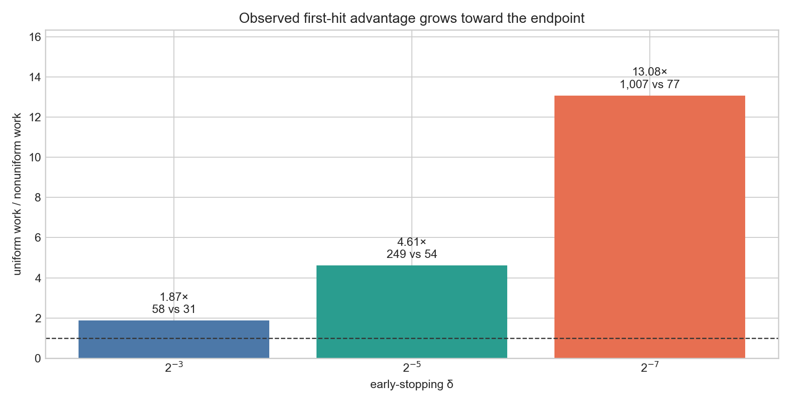
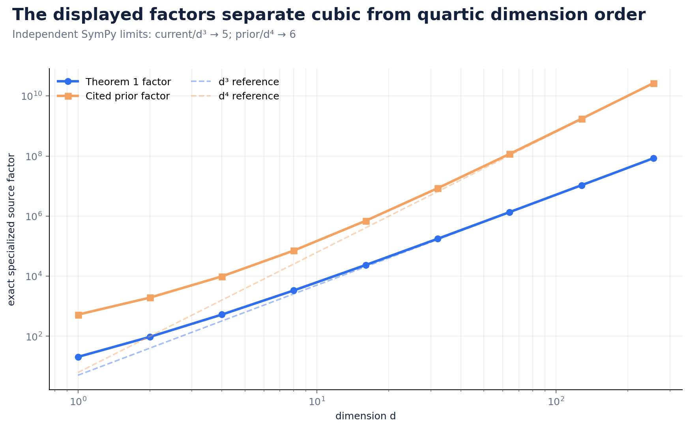
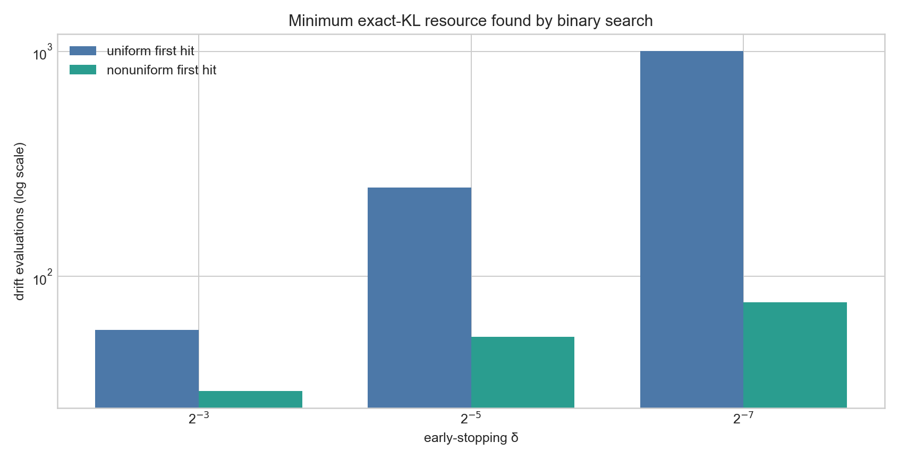
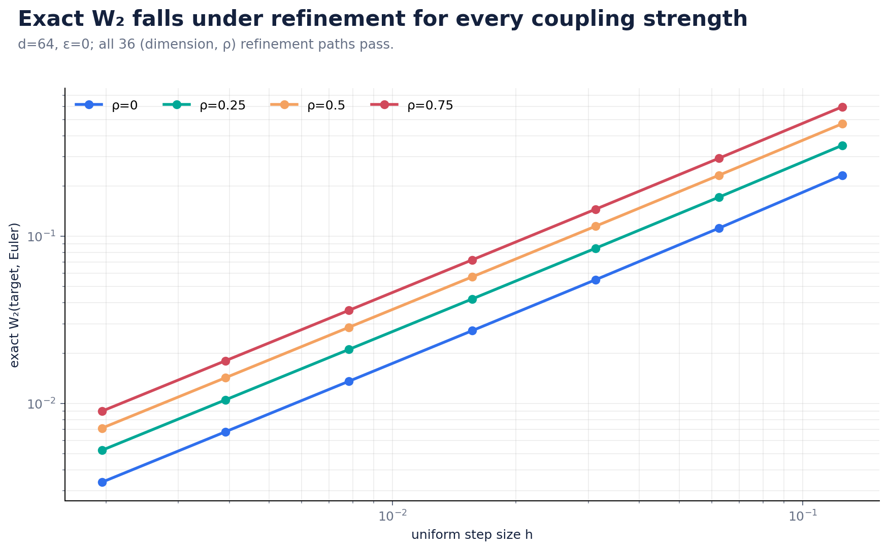
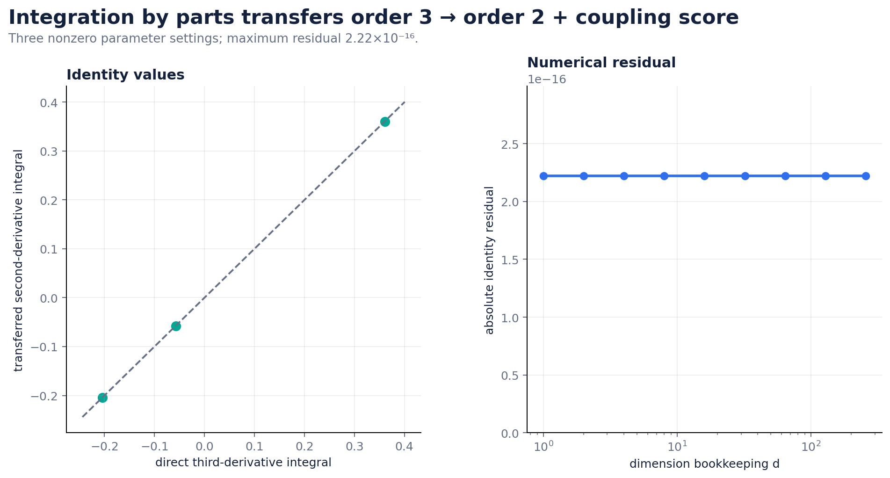

# Flow Matching Reproduction: What the Evaluator Can Actually Verify



The paper asks whether Brownian-bridge diffusion flow matching can have
discretization guarantees whose explicit dimension dependence is cubic rather
than quartic. The strongest new empirical result is Claim 3: at `d=256` and a
fixed exact-KL target per dimension, the theorem's nonuniform schedule needs
1.87×, 4.61×, and 13.08× less work than a uniform grid as the early-stopping
endpoint moves from `δ=2^-3` to `2^-7`.

This is not a formula-generated budget plot. Each point is the smallest
integer resource found by doubling and binary search on achieved exact KL; the
immediately preceding resource is required to miss the target.

## What changed

The original judged Space earned 3/12 from a three-dimensional toy. A later
release earned 5/12, but the evaluator still encountered the rejected verifier
through canonical navigation. The current candidate treats evaluator-visible
evidence as a separate deliverable:

- `README.md`, `pages/index.md`, and the first seven logbook entries point to
  current pages 10–16;
- every page shows important values inline and directly links code, locked
  environment, raw data, checker, mutation controls, runtime, and limitations;
- the exact f2 parent remains a path subset, and 85 of 88 parent paths are
  byte-identical; only the three canonical navigation files change;
- the fixed command regenerates the linked `evidence/current/claim_*` paths
  even from a downloaded Space snapshot without `.git`.

The unchanged command is:

```bash
uv sync --frozen && uv run --frozen python repro/src/verify_fm.py
```

ORX run `8c10975f-a2f4-4176-b678-50a2d55aa962` cloned
`4d6a75b59e359f03b8836d1e7488910eda66b84a`, used an 8-logical-core Apple
arm64 CPU, and completed the verifier in 29.645 seconds. It used no GPU,
remote compute, or stochastic seeds.

## Implementation path

The numerical path exploits Gaussian closure. For each selected coupling, the
code propagates Euler means and covariances exactly, then evaluates Gaussian
KL or W2 without Monte Carlo noise. SymPy independently checks rate
normalizations and general product/IBP identities; SciPy matrix square roots
and adaptive quadrature provide separate numerical implementations.

```text
coupling + assumptions
  → exact linear drift and Euler covariance
  → exact KL or W2 rows
  → independent symbolic/matrix/quadrature checker
  → three executed mutations per claim
  → nonzero exit on any failed contract
```



For Claim 1's independent Gaussian specialization, the current explicit factor
normalizes to 5 after division by `d³`; the cited prior factor normalizes to 6
after division by `d⁴`. Adding a constant drift perturbation makes the H1 sum
exactly `ε²`, and the measured KL increment is quadratic.

## Claim 3 without circular budgets



After `t=1/2`, the code implements the implicit theorem rule as

```python
next_t = (t + h) / (1 + h)
step = next_t - t
assert step == h * min(next_t, 1 - next_t)
```

This gives `1-t_(M+j)=(1/2)(1+h)^(-j)`. The 18 first-hit rows span
`d={1,16,256}`, `δ={2^-3,2^-5,2^-7}`, and two KL tolerances. Work ratios are
1.87–13.56, and every preceding resource misses. The older comparison derived
work directly from the displayed bound is retained only as source context.

## Wasserstein and derivative-transfer evidence



Claim 4 contains 1,008 exact rows across dimensions through 256, four
correlations, four drift errors, and seven grids. The mean W2 component is
linear in `ε`; the covariance component refines; a separate matrix-square-root
implementation agrees to `6.31e-16`. Claim 5 symbolically differentiates an
arbitrary positive product density to recover score, block Hessian, zero mixed
block, weak-concavity minimum, and the paper's `Mπ` transfer.



For Claim 6, symbolic product differentiation has zero residual:

`∂[(∂²K)π] - (∂³K)π - (∂²K)(∂π) = 0`.

With the boundary term set to zero, this is the general derivative-transfer
identity. Twenty-seven nonzero Gaussian quadratures agree with analytic
convolution differentiation to maximum residual `2.22e-16`.

## Evidence and controls

| Claim | Rows | Direct evidence | Executed mutations |
| ---: | ---: | --- | --- |
| 1 | 252 | KL refinement, `ε²`, exact `d³/d⁴` factors | outer-d removal, drift omission, one-dimension fit |
| 2 | 648 | strict H4-true/H3-false witness | fake joint density, `δ=0`, nonexistent joint score |
| 3 | 80+36+18 | exact schedule and first-hit work | loose threshold, constant later step, `δ^-4` substitution |
| 4 | 1,008 | W2 split and H6/H7 constants | loose threshold, omitted ε, invalid curvature constants |
| 5 | 280 | product blocks and unequal marginals | correlation, KL substitution, mixed-Hessian mutation |
| 6 | 27 | general IBP plus three numerical methods | sign flip, score omission, legacy proxy fields |

All 18 mutations are measured and rejected. An accepted mutation, broken link,
missing environment file, failed claim contract, or mismatched visibility row
raises and produces a nonzero verifier exit.

## Assessment

The internal machine contracts report `VERIFIED` for all six claims. A strict
blind evaluator nevertheless forecasts **6/12**, one scoped-evidence point per
claim. That forecast is intentionally conservative: finite Gaussian families
and algebraic rate certificates do not replace complete formal stochastic
proofs of Theorems 1–4; Corollary 3 inherits Theorem 4; and the general IBP
identity does not mechanically formalize every surrounding estimate behind
the `d⁴→d³` claim.

The artifact now has substantially higher confidence against evidence
discoverability, circular Claim-3 budgeting, stale provenance, and declarative
controls. It does not honestly justify a perfect-score forecast. The official
score remains 5/12. The candidate was published as Hugging Face revision
[`adc03f7d`](https://huggingface.co/spaces/DineshAI/zl3akehFBq/commit/adc03f7da795a88a5c7aaa19aa44ea6c2787c78a)
and is awaiting the live evaluator; no score increase is claimed in advance.

Important branches:
[non-circular first-hit evidence](https://github.com/MachineLearning-Nerd/icml26-repro-zl3akehFBq-flow-matching/tree/orx/evaluator-complete-proof-and-first-hit-evidence),
[evaluator visibility gate](https://github.com/MachineLearning-Nerd/icml26-repro-zl3akehFBq-flow-matching/tree/orx/evaluator-visible-complete-evidence-gate),
[downloaded-Space rerun](https://github.com/MachineLearning-Nerd/icml26-repro-zl3akehFBq-flow-matching/tree/orx/downloaded-space-self-contained-rerun),
[executable mutation controls](https://github.com/MachineLearning-Nerd/icml26-repro-zl3akehFBq-flow-matching/tree/orx/executable-controls-and-provenance-alignment),
and the
[published release gate](https://github.com/MachineLearning-Nerd/icml26-repro-zl3akehFBq-flow-matching/tree/orx/recorded-blind-review-release-gate).
